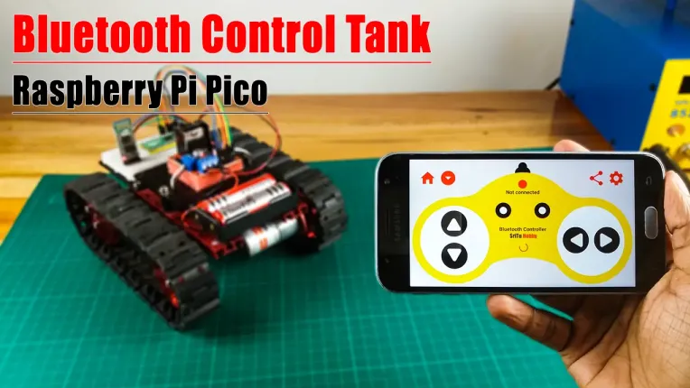

# PicoBot2 Project Notes: Taking PicoBot to the next level

## Joystick control options

* Joystick implemented in JavaScript code (originating on Pico webserver, running on client prowser)
* Onscreen joystick running on laptop, sending data to Picobot via:
    * WiFi
    * Bluetooth
* Physical joystick (eg.: playstation gamepad), sending data to Picobot via:
    * WiFi
    * Bluetooth
    
### Learn how to create and display an [onscreen joystick](https://www.cssscript.com/onscreen-joystick/#google_vignette)

* Roberto D'Amico (bobboteck) [on github](https://github.com/bobboteck/JoyStick)
    * [Multi-joystick demo](https://bobboteck.github.io/joy/joy.html)
    * My initial attempt at implementing a [single joystick](/home/doug/pico-projects/joystick/JoyStick-master/joy_single.html)
    * Google Ad showing [single joystick example](https://www.cssscript.com/demo/onscreen-joystick/)
* [Another joystick demo](https://jsfiddle.net/aa0et7tr/5/)
    * [My implementation](/home/doug/pico-projects/joystick/pure_js_joystick/combined.html)

In order to examine and revise these, I first need to spin up on javascript and CSS [W3schools JS Tutorial](https://www.w3schools.com/js/default.asp)

I like the bobboteck example but it has a lot of extra "cruft" associated with showing how to display multiple joysticks. The Google ad does a nice job of getting rid of the unwanted cruft but adds their own extra stuff.

I copied the source of the Google page into the bobboteck folder [here](/home/doug/pico-projects/joystick/JoyStick-master/google_ad.html) and removed the Google Ad stuff while keeping the intrinsic simplicity of the code. It works fine and seems pretty clean.

#### Other joystick projects

* [Send joystick data over BT](https://srituhobby.com/how-to-make-a-bluetooth-control-tank-with-raspberry-pi-pico-board/)

### Learning more about javascript and REST APIs

Looking at the javascript code in [Bob Grant's code](https://bytesnbits.co.uk/web-control-panel-web-page/) and the javascript code in the joystick examples makes me realize that I don't have a good fundamental understanding about how javascript works. To remedy this, I need to learn more about how javascript front ends work.

* I found [Full Stack Python](https://www.fullstackpython.com/javascript.html) which has some links that look good.

* Also found this RealPython tutorial [Python and REST APIs: Interacting With Web Services](https://realpython.com/api-integration-in-python/)

* Also [Python REST API: Build and Deploy Your Own Custom Server](https://www.xingyulei.com/post/py-http-server/)

* More Google searches on:
    * "How to create REST API in Python without flask"
    * "micropython rest api pico"
* Decided to put the joystick idea *on the shelf* for now.

### Found a joystick implemented in pyqt4 and revised it for pyqt5: `joystick.py`

* Revised the basic Pico Example: Controlling an LED using an async webserver: `async_webserver.py`
* The plan is to get x, y coordinates from the joystick and feed them to the pico webserver, which will interpret them as linear speed and steering (angular speed) and drive the motors accordingly.
    * `joystick.py` will run on the laptop, sending GET requests to the Picobot
        * Send to this URL: http://192.168.1.64/x/y
    * The webserver is running under `main.py` on the Pico
        * Gets x, y values, calculates a & b motor direction & speed, drives motors
* I actually decided to use the PS4 joystick instead and communicate over WiFi
    * With each new (x, y) pair from the joystick, send them to picobot webserver.
    * The picobot interprets them: x=linear speed, y=angular speed
    * Wait for response from server then detect the next pair.
* I guess I could have used this same approach with the PyQt joystick. Just send the data as soon as it is detected.

